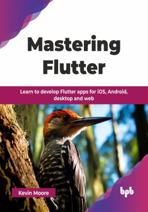

# Mastering Flutter

Learn to develop Flutter apps for iOS, Android, desktop and web.

This is the repository for [Mastering Flutter
](https://bpbonline.com/products/mastering-flutter?variant=44456678457544),published by BPB Publications.

## About the Book
Mastering Flutter is ideal for the developer at the beginner level as well as the developer who wants to switch to Flutter. This book starts at the beginner level so that you know everything you need to create apps that can be published in different mobile stores. You will develop a movie app that is beautiful, has animations, uses a movie API to get the latest movie information and uses Firebase to store user information.

Learn Flutter app development from the ground up, starting with the basics of Flutter and Dart code. By creating a movie app, you will master building user interfaces, managing data, and adding different screens. You will make your app look great with custom designs and smooth animations. The app will connect to the internet, save data locally, and use Firebase to handle user accounts and send notifications. You will also learn how to make your app work on websites and computers, respond to user actions, and add extra features from Flutter's package library. The final steps cover testing your app, making it run faster, and getting it ready for users to download.

Finally, you will learn how to publish your apps on the Google Play Store and the Apple App Store, starting your career as a mobile developer. You will be able to create websites and desktop applications of the same app.

## What You Will Learn
• Build apps for phones, computers, and websites using Flutter - a powerful development toolkit that uses the Dart programming language as its foundation.

• Create beautiful app screens using widgets and add smooth transitions when users move between different parts of your app.

• Make your app respond quickly by downloading data in the background, and learn how to save important information on the user's device.

• Connect your app to the internet to fetch data from online services, and use databases to organize and store information efficiently.

• Create your own Flutter add-ons to access special features on different devices, and learn how to test your app to make sure it works perfectly.
